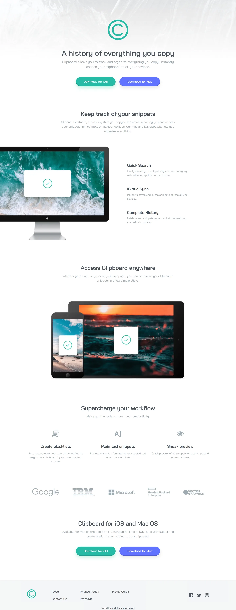

# Clipboard landing page

My solution to the [Clipboard landing page](https://www.frontendmentor.io/challenges/clipboard-landing-page-5cc9bccd6c4c91111378ecb9)
challenge on Frontend Mentor.

- Live: https://clipboard-landing-page.abdelrhman-ahmed8881.workers.dev
- Code: https://github.com/MrBlackvanta/clipboard-landing-page

## Built with

- Next.js 16, App Router
- React 19 and TypeScript
- Tailwind CSS v4
- Bai Jamjuree via `next/font`

## Notes

Tailwind is configured entirely in CSS with `@theme` and `@utility`, no config file.
Tracking is defined in `em` so it scales with the font size instead of drifting.

Images are static imports through `next/image`, so dimensions come from the file and
there's no layout shift. Icons are inline SVG driven by `currentColor`.

Animations sit behind `prefers-reduced-motion`.

### Contrast

I built the palette as supplied, but three pairings fail AA and I'd rather write that
down than quietly change the brand:

- Grayish Blue body copy on white, about 2.4:1
- White label on the Strong Cyan button, about 2.4:1
- White label on the Light Blue button, about 3.9:1

Headings, footer links and the attribution use Dark Grayish Blue at about 7.7:1 and are
fine.

## Author

- [LinkedIn](https://www.linkedin.com/in/abdelrhman-vanta/)
- [UpWork](https://www.upwork.com/freelancers/mrblackvanta)
- [Frontend Mentor](https://www.frontendmentor.io/profile/MrBlackvanta)
